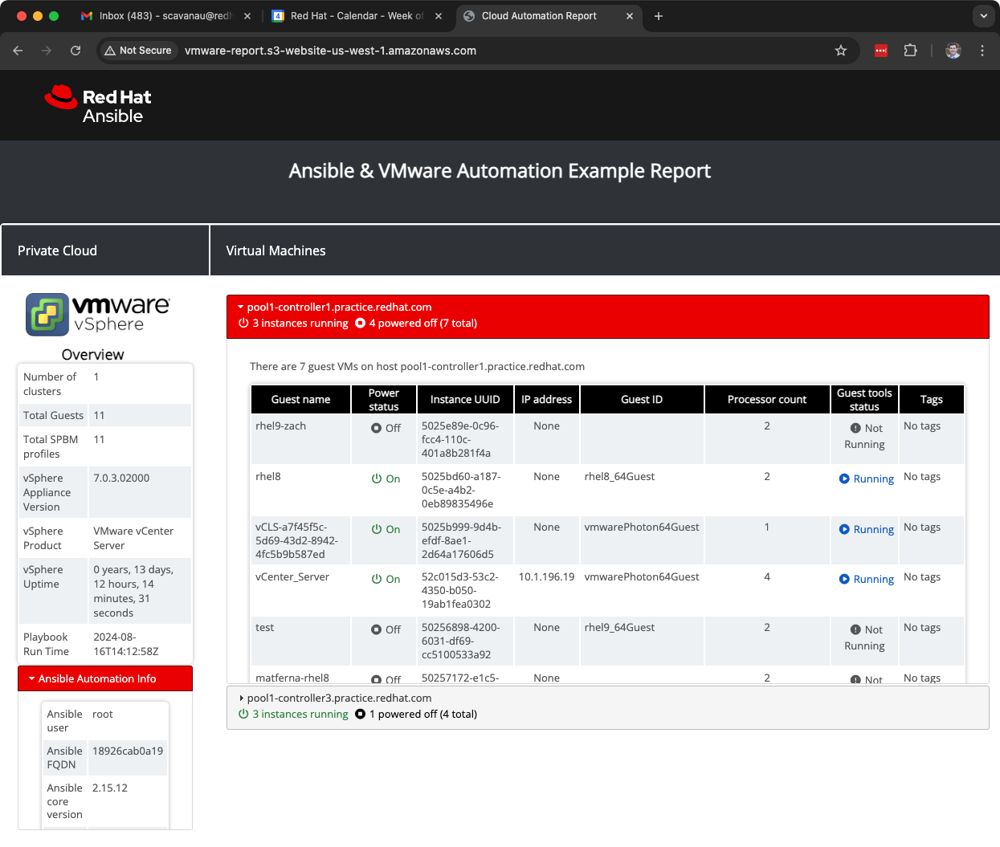

# vmware-demos

Create a file login_info.yml and insert the following into it:

```
vcenter_hostname: "vcenter.example.com"
vcenter_username: "your_username"
vcenter_password: "your_password!"
```


# Dynamic Documentation


Here is an example screenshot of the generated report using the `cloud.vmware_ops.info` role to retrieve information.

